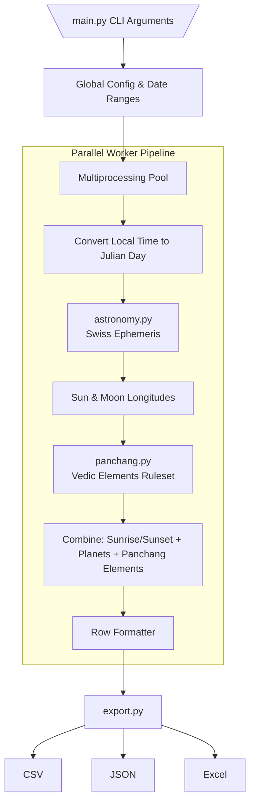

# Architecture Overview

This document provides a birds-eye perspective on how the Panchang Generator transforms a generic calendar date into precise Vedic astrological structures.

## System Workflow Pipeline

The processing lifecycle is largely grouped into three distinct components:
1. **Astronomical Interface (Backend):** Fetching positional metrics mathematically.
2. **Vedic Interpreter (Middleware):** Assigning Vedic names and logic to astronomical metrics.
3. **Assembler & Exporter (Frontend/Runner):** Parallel processing, dictionary building, and file serialization.

## Data Lifecycle

For every day inside `--start_year` and `--end_year`:
1. **Time Initialization**: Computes standard computation time per regional configuration. For Indian Standard Time, this generally equates to computing parameters at precisely `05:30 IST` (or `00:00 UTC`). It converts civil datetime arrays into a decimal **Julian Day Number**.
2. **Retrieve Astronomical Measurements**: It uses Swiss Ephemeris wrappers (`pyswisseph`) to determine exact True Node planetary longitudes (Sidereal / Nirayana scheme).
3. **Parse Elements**: A custom Panchang ruleset measures the angular separation between the calculated Sun and Moon arrays:
   - Example Tithi Logic: `floor((Moon - Sun) / 12) + 1`
   - Nakshatra Logic: `floor(Moon / 13°20') + 1`
4. **Endpoint Seekers**: For certain metrics (like 'When does the Tithi end today?'), a secondary algorithm loops iteratively checking subsequent Julian Days using a classic binary convergence approximation.
5. **Row Structure Generation**: Converts angular metrics down to standard DMS (`Degrees° Minutes' Seconds"`) strings securely and queues the row dict buffer back to the native Multiprocessing Pool.

Finally, the `export.py` module catches all queued objects once the workers are exhausted and natively utilizes Pandas or CSV writers.
