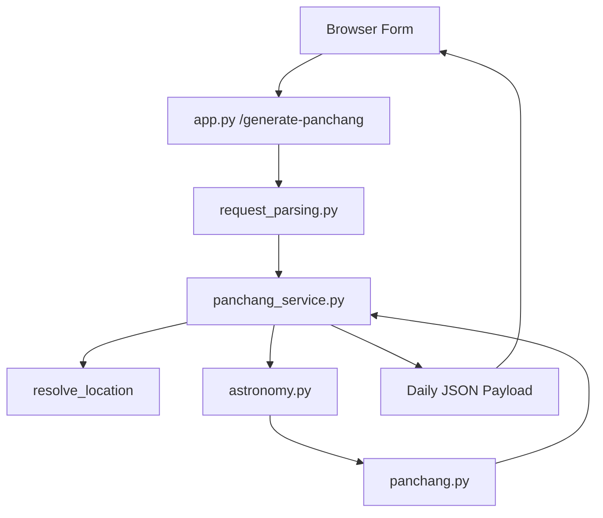
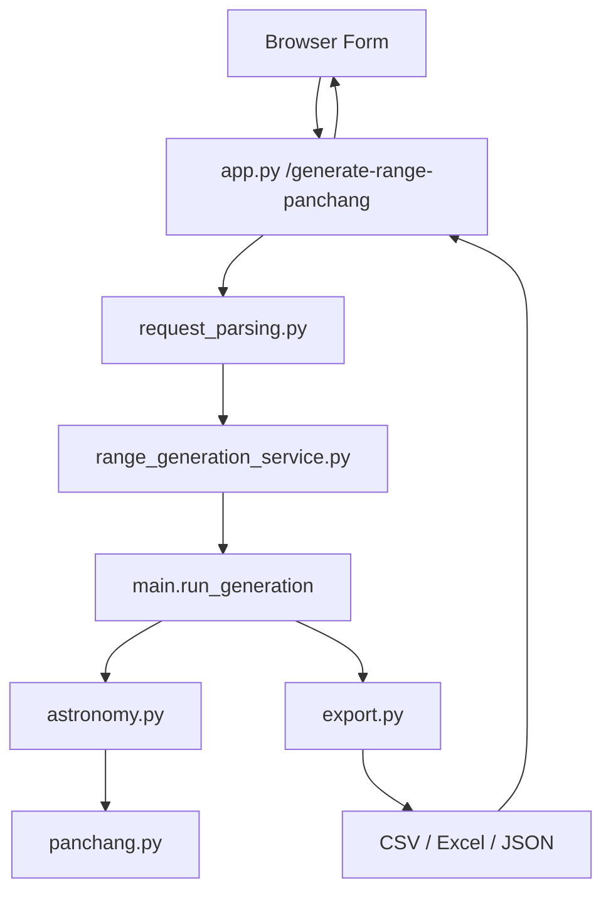
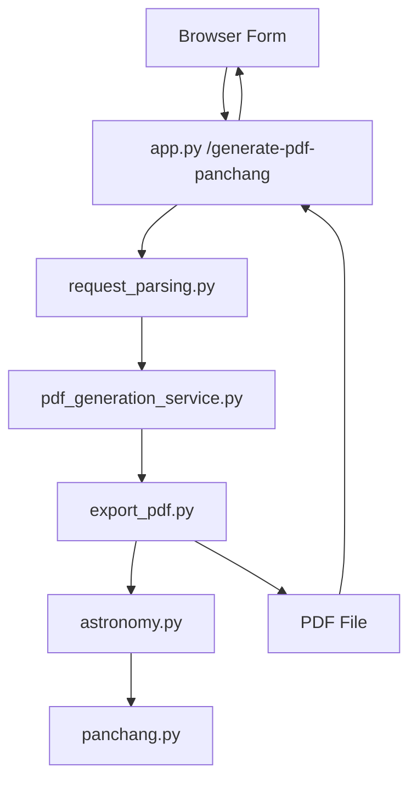

# Architecture

This document explains how the system is organized and why the main modules are separated the way they are.

## 1. High-Level View

The project has three runtime-oriented product flows:

1. daily Panchang lookup through the web UI
2. year-range data export through the web UI or CLI
3. printable PDF generation through the web UI

These flows share core Panchang and astronomy logic, but they do not all need the same output assembly path.

## 2. Main Layers

At a high level, the codebase can be understood in four layers.

### Layer A: Input and delivery

This includes:

- Flask routes in `app.py`
- CLI argument parsing in `main.py`
- frontend files in `templates/index.html`, `static/app.js`, and `static/app.css`

Responsibilities:

- accept user input
- validate or forward requests
- present or download results

### Layer B: Request and workflow orchestration

This includes:

- `request_parsing.py`
- `panchang_service.py`
- `range_generation_service.py`
- `pdf_generation_service.py`

Responsibilities:

- normalize API inputs
- resolve locations
- choose the correct generation path
- assemble final payloads or file outputs

### Layer C: Astronomy and Panchang rules

This includes:

- `astronomy.py`
- `panchang.py`

Responsibilities:

- Swiss Ephemeris interaction
- time conversion
- planetary longitudes
- rise/set calculations
- Tithi, Nakshatra, Yoga, Karana, Vara calculations
- transition end-time search

### Layer D: Serialization

This includes:

- `export.py`
- `export_pdf.py`

Responsibilities:

- flatten row data
- write CSV, Excel, and JSON files
- render PDF tables

## 3. Web Daily Request Flow

The daily generator follows this path:

### Why this structure exists

The route handler stays intentionally thin. That makes it easier to test validation and service behavior independently and reduces the chance of duplicating rule logic inside Flask handlers.

## 4. Year-Range Export Flow

The range generator uses the web API but reuses the existing CLI computation engine.

### Why reuse `main.run_generation`

The CLI pipeline already contains:

- date iteration
- per-day computation
- optional multiprocessing
- row shaping for export

Reusing that engine avoids maintaining two separate range-generation implementations.

## 5. PDF Generation Flow

The PDF path uses a separate exporter because PDF layout logic is presentation-heavy and not the same as flat tabular export.

## 6. Validation Boundaries

Validation is intentionally split across layers.

### Request-level validation

`request_parsing.py` validates:

- presence of required fields
- integer year fields
- numeric coordinates
- complete coordinate pairs
- allowed output formats

### Domain-level validation

`panchang_service.py` validates:

- coordinate ranges
- timezone resolution
- existence of required solar events
- sunrise belonging to the requested civil date
- sunset occurring after sunrise

This split is useful because it separates malformed input from failed astronomical or domain resolution.

## 7. Rule Model

The current rule model is intentionally conservative in wording.

The implementation currently does this:

- determines the primary daily Tithi at local sunrise
- computes the day’s Nakshatra, Yoga, Karana, and Vara from the same sunrise reference
- exposes the Jain Tithi reference at `+2h24m` after sunrise

The implementation currently does not claim:

- that `+2h24m` is the authoritative Jain rule for all use cases
- that the system fully models Agamic Jain calendar rules

That distinction is important for correctness and documentation honesty.

## 8. File Download Strategy

Generated files are written to temporary export directories under `/tmp`, then exposed through tokenized download URLs.

This design keeps:

- route handlers simple
- frontend integration easy
- generated filenames user-friendly

The tokenized path also avoids exposing arbitrary filesystem paths directly in the browser.

## 9. Frontend Design Notes

The UI is organized into three independent action areas:

1. daily JSON-style lookup
2. range export generation
3. PDF generation

The location and ayanamsa inputs are shared at the page level so the user does not need to repeat them for the other generators.

## 10. Extension Points

If you want to extend the system, these are the natural places:

### Add a new export type

- add request validation in `request_parsing.py`
- add a new service module if the workflow differs materially
- add a new route in `app.py`
- add UI controls in `templates/index.html` and `static/app.js`

### Change rule logic

- update `panchang_service.py` for daily orchestration rules
- update `panchang.py` only if the actual math changes
- update tests in `tests/test_panchang_rules.py`
- update docs in `docs/calculations.md`

### Improve exports

- update `export.py` for flat file formats
- update `export_pdf.py` for PDF layout changes

## 11. Tradeoffs and Current Limitations

The current architecture makes pragmatic tradeoffs:

- range export reuses the CLI-style engine rather than duplicating logic
- PDF export uses a dedicated table renderer rather than a generic export abstraction
- daily and export paths share rule logic where possible but still have distinct output assembly layers

These choices keep the project easier to maintain while still allowing new UI workflows to be added quickly.
